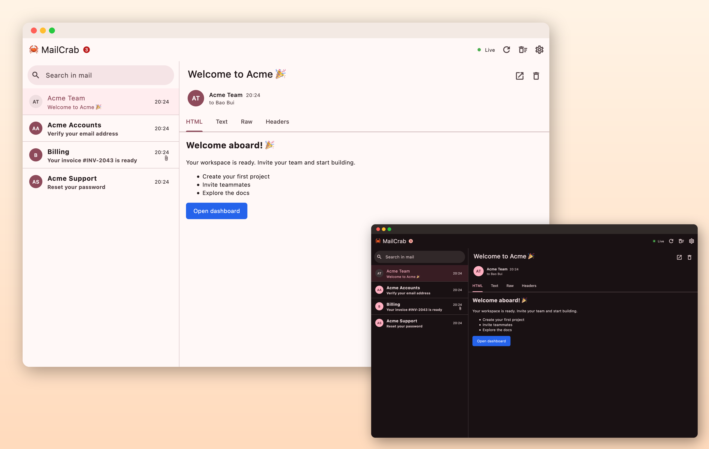
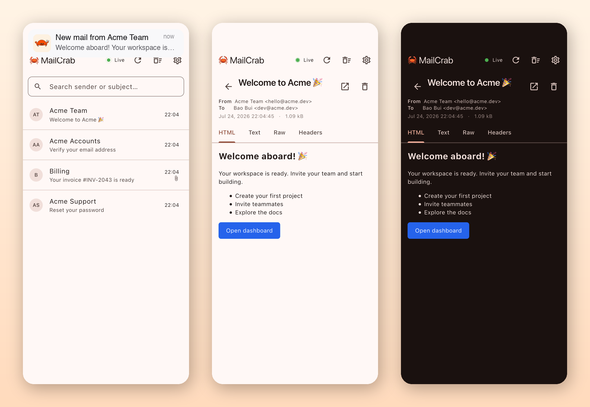

# 🦀 MailCrab Client

[](https://github.com/quocbao238/mailcrab_client/releases/latest)
[](https://github.com/quocbao238/mailcrab_client/actions)

A native desktop & mobile client for [MailCrab](https://github.com/tweedegolf/mailcrab) — the email testing server for development. Stop keeping a browser tab open: get your test emails in a native app with **system notifications the moment mail arrives**, an unread badge on the app icon, and a fast searchable inbox.

<p align="center">
  
</p>

<p align="center">
  
</p>

- ⚡ **Real-time inbox** — new mail appears instantly (WebSocket, with automatic fallback to polling)
- 🔔 **Native notifications** — with a preview of the email body; click to open the message
- 🔴 **Unread badge** on the app icon (macOS Dock, Windows taskbar)
- 📎 View HTML / plain text / raw source / headers, download attachments
- 🎨 Light/dark mode and theme colors, applied instantly
- 🔌 Works with any MailCrab server — local Docker or remote, HTTPS and path prefixes supported

## 📥 Download

<p align="center">
  <a href="https://github.com/quocbao238/mailcrab_client/releases/latest/download/MailCrab-macos.dmg"></a>&nbsp;&nbsp;
  <a href="https://github.com/quocbao238/mailcrab_client/releases/latest/download/MailCrab-linux-x64.tar.gz"></a>
  <br><br>
  <a href="https://github.com/quocbao238/mailcrab_client/releases/latest/download/MailCrab-android.apk"></a>&nbsp;&nbsp;
  <a href="https://github.com/quocbao238/mailcrab_client/releases/latest/download/MailCrab-windows-x64.zip"></a>
</p>

<p align="center"><sub>macOS: universal (Intel & Apple Silicon) · Linux/Windows: x64 · <a href="https://github.com/quocbao238/mailcrab_client/releases">older versions</a></sub></p>

## 🚀 Install

### macOS

1. Open the `.dmg` and drag **MailCrab** into **Applications**.
2. First launch: macOS may warn that the app is from an unidentified developer (it isn't notarized yet). Fix it with either:
   - **System Settings → Privacy & Security →** scroll down **→ Open Anyway**, or
   - Terminal: `xattr -cr /Applications/MailCrab.app`
3. Allow notifications when prompted. If banners don't appear, make sure **Focus / Do Not Disturb is off**.

### Linux

```bash
mkdir -p ~/mailcrab && tar xzf MailCrab-linux-x64.tar.gz -C ~/mailcrab
~/mailcrab/mailcrab_client
```

Requires GTK 3 (preinstalled on most desktops) and a notification daemon (GNOME, KDE, XFCE… all work).

### Windows

Unzip anywhere and run `mailcrab_client.exe`. Notifications appear as standard Windows toasts; the unread count shows as a red overlay on the taskbar icon.

### Android

Install the APK (enable "Install from unknown sources" if asked). To reach a MailCrab running on your computer, use your machine's LAN IP in Settings (e.g. `http://192.168.1.20:1080`) — or `http://10.0.2.2:1080` from the Android emulator.

## 🏁 Getting started

1. Run a MailCrab server if you don't have one:

   ```bash
   docker run --rm -p 1080:1080 -p 1025:1025 marlonb/mailcrab:latest
   ```

2. Open MailCrab Client — it connects to `http://localhost:1080` by default. Use **Settings** (⚙) to point it at any other server and hit **Test connection**.
3. Point your application's SMTP settings at `localhost:1025` and watch the mail roll in — with a notification for every message.

### Servers behind an SSO login

If your MailCrab sits behind an auth gateway (the API answers with a redirect to a sign-in page), hit **Settings → Sign in with SSO**. A window opens, you complete the normal login, and the app keeps the resulting session cookie — sending it with every REST call and on the WebSocket handshake.

**Expiry takes care of itself.** The gateway cookie is short-lived, but the identity provider's own session outlives it and stays in the sign-in window's cookie store. When a request comes back rejected, the app replays the redirect chain in the background and picks up a fresh cookie with no interaction — the status chip briefly reads "Signing in…". Only when the provider session itself is gone do you see a banner asking you to sign in again.

On platforms without an embedded WebView (Linux), or for CI, paste a cookie manually instead: sign in with a browser, copy the `Cookie` request header from DevTools → Network, and put it in **Settings → Auth cookie**.
